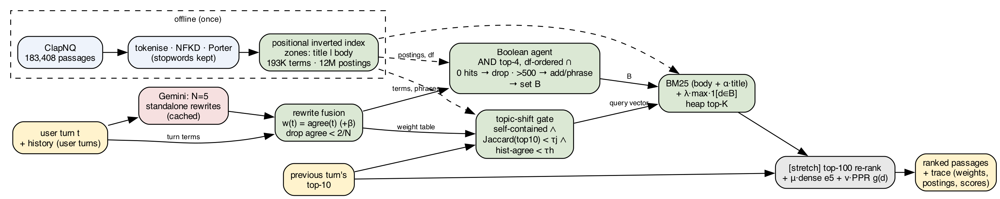
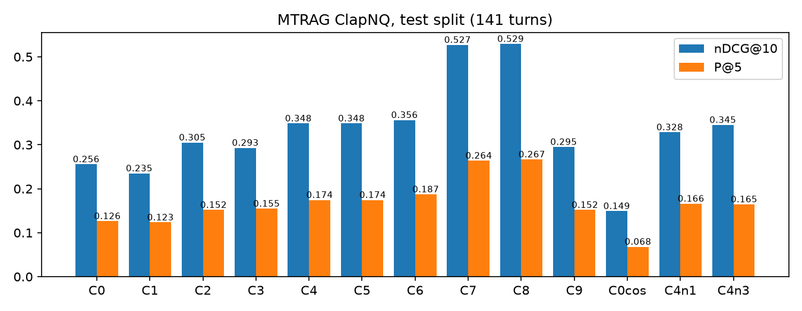
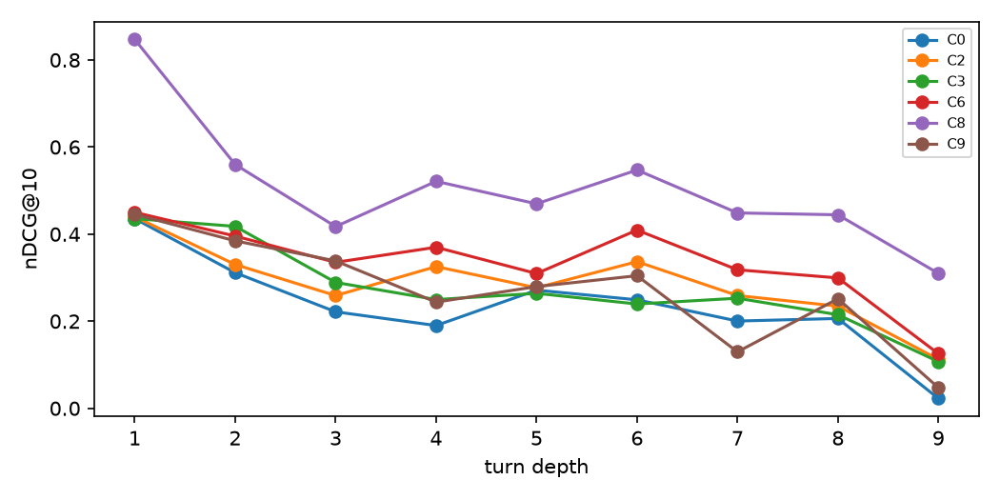

**Code:** <https://github.com/rgabhi2526/ir-convsearch> · **Video:** <https://youtu.be/-oK4R0H-jAg>

# 1. Problem and track relevance

In a conversation, users stop repeating themselves. After *"types and causes of male and female infertility"* and *"How many years, think about adoption?"*, the third question is just *"Regional differences"*. Taken alone, that turn is unsearchable, and a search engine that sees only the last turn returns nothing useful: BM25 on the last turn scores nDCG@10 = 0 here. T2 asks for multi-turn search that tracks context and rewrites queries *before* retrieval. That is the problem we solve.

The standard fix today, used in frameworks such as LangChain's history-aware retriever, is to ask an LLM for **one** standalone rewrite and search with it. That has two failure modes:

1. **Commitment to one reading.** For the example above, the single rewrite is "regional differences in adoption rates". The infertility reading is silently lost, and so are the relevant passages (nDCG@10 = 0).
2. **Hallucinated terms.** A rewrite can add words the user never meant, such as "2023 season", and the search engine trusts them fully.

We treat the LLM as a *noisy proposer* and keep every decision about terms, weights and ranking inside a hand-built IR engine. The LLM gives N = 5 rewrites. Our engine decides, from agreement statistics and from the postings lists, which terms matter.

**Papers referred.**

- **MTRAG** [1]: the benchmark and data we use.
- **TREC CAsT** [2]: conversational query reformulation as an IR task.
- **Sequence-to-sequence query rewriting** [3, 4]: the single-rewrite approach.
- **LLM4CS** [5]: closest to us. It also samples several LLM rewrites, but aggregates them as *dense embeddings*. We aggregate at the *term level* in a sparse, inspectable vector.
- **Relevance models / RM3** [6]: weighting query terms by evidence from several sources.
- **Others:** BM25 [7], Personalized PageRank [8], and e5 embeddings [9].

# 2. How we used IR

{width=100%}

| IR principle (lecture) | Where in code | Why |
|------------------|-------|--------------------|
| Tokenisation, case folding, NFKD accent stripping, Porter stemming | `text.py` | Rewrites and passages must map to the same terms; e.g. "Cardinals" and "cardinal" both become `cardin`. |
| Stop words removed **only on the query side** | `text.py`, D9 | The index keeps stopwords with positions, so phrase queries like `"the who"` still work. |
| **Positional inverted index** with **zones** (title, body) | `index.py` | 183,408 passages; 192,988 terms; 12.0M body postings; built in 26 s using 1.2 GB RAM. Postings are flat numpy arrays (CSR layout). Positions support phrases; zones support title weighting. |
| BM25 (k1 = 1.2, b = 0.75) over a *weighted* query vector; zone score body + α·title | `rank.py` | Matches the `bm25s` library to within 3.8·10⁻⁶ (`run_eval.py --check-bm25s`). |
| tf-idf **lnc.ltc** cosine | `rank.py` | Compared as an alternative scorer; it is much worse on passages (Table 2). |
| Term-at-a-time accumulation + **heap top-K** | `rank.py` | 10.6 ms per conversational turn for the full core pipeline. |
| **Boolean retrieval**: parser for AND/OR/NOT/"phrase", **intersection in increasing-df order**, phrases checked via positions | `boolean.py` | Used by the agent and also typed directly by users (`arizona NOT chicago`). |
| **Jaccard** coefficient over result sets | `gate.py` | Detects topic shifts: the turn's own top-10 vs the previous turn's top-10. |
| idf, df statistics as feedback | `fuse.py`, `agent.py` | Term weighting and the agent's 0 / >500 hit rules. |
| Out-of-syllabus: BM25, dense retrieval (e5), Personalized PageRank as g(d) | `rank.py`, `rerank.py` | Extra-credit components; reported separately (C7, C8). |

**Rewrite fusion** (`fuse.py`): our main idea. Given rewrites $r_1 \dots r_N$, we compute three quantities per term:

- **Agreement:** agree(t) = |{i : $t \in r_i$}| / N.
- **Origin tag:** each term is marked *turn* (typed now), *history* (from earlier turns) or *llm-only*.
- **Weight:** w(t) = agree(t) + β·$\mathbf{1}$[t typed in this turn], with β = 0.5.

A term proposed by fewer than 2 of the N rewrites, and not typed by the user, is **dropped** as a likely hallucination. The fused vector is scored with BM25, so idf enters once, inside BM25. Our first design multiplied by idf in w(t) as well, which effectively scored with idf². Tuning rejected that (D16).

For *"Regional differences"*, the five rewrites split between adoption and infertility. Fusion therefore keeps **both** readings: `infertil` 0.6, `adopt` 0.6, `region` 1.1, `differ` 1.1. It drops the one-off terms `dispar`, `caus`, `male` and `femal`.

**Boolean agent with df feedback** (`agent.py`):

1. Start with the AND of the 4 highest-weighted terms (phrases are adjacent word pairs that appear in at least $\lceil N/2 \rceil$ rewrites).
2. Intersect postings, shortest list first, to get the hit count h.
3. If h = 0, drop the lowest-agreement term. Ties go to the highest idf, because rare terms over-constrain. Terms the user typed are dropped last (D18).
4. If h > 500, add the next term or switch to the phrase.
5. Stop after at most 3 attempts.

The accepted set B gets a **bonus** of λ·max score, not a hard filter (D11). Filtering kills recall. For the example, `infertil AND region AND differ AND adopt` gives 0 hits, so the agent drops `infertil`, and `region AND differ AND adopt` gives **15** hits, which is accepted. Final nDCG@10 = 0.50, vs 0 for the single rewrite.

**Topic-shift gate** (`gate.py`): if a turn is self-contained, history terms are zeroed. A turn counts as self-contained when it has no anaphor, at least 3 content terms and $\sum$ idf $\geq \tau_{idf}$. Jaccard on its own is not enough: *"what about its price?"* also has zero overlap with the previous results.

**Engineering rules.** Every component is a config switch on one function, `pipeline.run(turn, history, prev_topk, config)`. Each turn returns a **trace** of every intermediate value: rewrites, weight table, gate numbers, every Boolean attempt with postings sizes, and scores. The evaluation and the Streamlit demo call exactly the same function. Turns are processed in order, and `prev_topk` is the system's *own* previous top-10, so no oracle information leaks into the gate.

# 3. Beyond IR

- **LLM (Gemini 3.5 flash-lite, temperature 0.7, JSON output).** It only proposes rewrites; it never ranks, filters or answers. All 221 rewrite sets are cached in the repository, so every number in this report reproduces with zero API calls. A no-LLM mode (C9), where the turn plus history terms go straight into fusion, shows the IR pipeline stands on its own.
- **Dense re-ranking (e5-small-v2) and Personalized PageRank** (stretch, `rerank.py`). They re-score only BM25's top-100 candidates:
  - final = score/max + μ·minmax(cos(e5(q), e5(d))) + ν·minmax(g(d))
  - g(d) is PPR over a kNN graph (k = 5, tf-idf cosine) on the top-100 plus the previous turn's top-10, teleporting to the previous top-10 (damping 0.85).

# 4. Novelty

The baseline in tools today is a single LLM rewrite. Multi-rewrite methods [5] fuse dense embeddings, which are opaque. Our differences:

1. **Term-level agreement fusion.** Disagreement between rewrites becomes a sparse, readable weight per term, and low-agreement terms are pruned as hallucinations. Every number can be shown to the user (see the demo).
2. **The LLM proposes, the index disposes.** A Boolean agent checks proposed terms against **postings statistics** (hit counts from df-ordered intersection) instead of trusting them.
3. **An honest ablation of when each part helps** (Section 5). The Boolean feedback helps *with* an LLM, and the gate helps *without* one.

# 5. Evaluation

**Data.** MTRAG ClapNQ [1]: 183,408 Wikipedia passages; 29 human conversations; 208 judged turns; 578 qrels. Conversations sorted by ID: the first 10 are for **tuning** and the remaining **19 (141 judged turns)** are the **test** set. Every number below is on the test set. All parameters were chosen by grid search on the tune set (`eval/tune.py`):

α = 0.3, β = 0.5, λ = 0.2, $\tau_{idf}$ = 16, $\tau_j$ = 0.1, $\tau_h$ = 0.4, μ = 3, ν = 0.1. All configurations, including the baselines, use the same α.

| | Config | P@5 | P@10 | R@10 | nDCG@10 | MAP |
|--|------------------------------------------|-----|-----|-----|-------|-----|
| C0 | last turn, BM25 (baseline) | .126 | .097 | .343 | .256 | .202 |
| C1 | all user turns concatenated | .123 | .089 | .305 | .235 | .193 |
| C2 | single LLM rewrite (framework style) | .152 | .113 | .391 | .305 | .243 |
| C3 | MTRAG human rewrite ("oracle") | .155 | .110 | .384 | .293 | .232 |
| C4 | **rewrite fusion, N = 5** | .175 | .121 | .438 | .348 | .285 |
| C5 | C4 + gate | .175 | .121 | .438 | .348 | .285 |
| C6 | **C5 + Boolean agent (core system)** | **.187** | **.127** | **.452** | **.356** | **.287** |
| C7 | C6 + dense re-rank (stretch) | .264 | .175 | .622 | .527 | .439 |
| C8 | C7 + PPR (stretch, full) | .267 | .177 | .628 | .529 | .439 |
| C9 | no-LLM: fusion of turn + history, gate, agent | .152 | .111 | .391 | .295 | .235 |

: Test-set results (19 conversations, 141 judged turns). {#tbl:main}

**Main result.** The core system C6 beats the single-rewrite baseline C2 on nDCG@10 by +0.051 (+17%): 54 wins, 65 ties, 22 losses. **Paired t-test t = 3.72, p = 0.0003.** Against last-turn BM25 (C0) the gain is +0.100 (+39%). Fusion alone (C4) already beats the *human* rewrite (C3, 0.293). Five agreeing rewrites act as controlled query expansion, which one perfect rewrite cannot do. Even without any LLM, C9 beats C0 by +0.04.

{width=92%}

| Ablation | Result |
|--------------|------------------------------------------|
| Number of rewrites N (C4) | 1: .328 · 3: .345 · 5: .348. More rewrites help, with diminishing returns. |
| Scorer | BM25 .256 vs lnc.ltc cosine .149 on C0. Cosine's length normalisation over-rewards short passages, so BM25 is the default. |
| First turns vs follow-ups (C0 $\rightarrow$ C6) | First turns .436 $\rightarrow$ .450 (n = 18); follow-ups **.229 $\rightarrow$ .343** (n = 123). The gain comes from follow-ups, as intended. |
| Gate and Boolean, no LLM (tune) | neither .276 · +gate .293 · +Boolean .259 · both .286 |
| Gate and Boolean, with LLM (tune) | C4 .350 · +spec gate .332 · +Boolean .379 |

: Ablations (nDCG@10). {#tbl:abl}

**What the ablations say.** The **Boolean df-feedback bonus helps when terms come from rewrites** (+0.03–0.05). It confirms terms that co-occur in the collection. It hurts when terms are just turn plus history, because that conjunction is often over-specific.

The **topic-shift gate helps without an LLM** (+0.017), where history would otherwise always be appended. With the LLM, the spec's gate fired on 41 of 191 follow-ups, many wrongly. For example, *"why 46% drop all the sudden? who are audiences?"* has three content words and no anaphor, yet depends on context. We added a condition: shift only if most rewrites did **not** keep the history terms (mean history agreement < $\tau_h$; D21). With that condition, the gate never fires when the LLM is on (C5 = C4). Our prompt already tells the LLM to drop old topics, so a separate IR gate is redundant there.

**Stretch.** Dense re-ranking of BM25's top-100 adds +0.17 nDCG@10 (C7). We report it separately so that the gain is not credited to fusion. PPR adds only +0.002.

{width=72%}

**Self-judged query set.** TODO, after judging with `eval/judge.py`:

- The two of us wrote N conversations (M turns) about topics in the corpus.
- Using TREC-style **pooling**, the top-5 of C0, C2, C6, C8 and C9 were merged and shuffled, and each of us judged every pooled passage independently. Cohen's κ = ___.
- With "relevant = both judges agree": P@5 C0 ___ · C2 ___ · C6 ___ · C8 ___ · C9 ___.

# 6. Limitations and next steps

- **Already-explicit turns can get worse.** Example: *"Do the Arizona Cardinals play outside the US?"* follows *"…play this week"*. The rewrites carry "week" over from history (agreement 1.0), and C6 scores 0.53 vs C0 0.67. Next step: down-weight history-origin terms when the current turn is self-contained.
- **Natural-language negation is not handled** (*"not the Chicago one"*). It is shown in the video. Explicit `NOT` does work.
- **No spelling correction.** Out-of-vocabulary terms (*"Cardnals"*) contribute nothing.
- **The gate is redundant with a good LLM** (Section 5).
- **Small test set.** 141 judged turns from one domain (Wikipedia). Other MTRAG domains (FiQA, Govt, Cloud) are left for future work.
- **Roadmap (course project):**
  - Learn the fusion weights (agree, origin, idf) with learning-to-rank instead of a grid.
  - Add champion lists or impact-ordered postings for speed.
  - Run on all four MTRAG corpora.
  - Use the agent's hit counts to ask a clarifying question when h = 0 for every reading.

# 7. Work division

| Member | Owned components (explained in the video) |
|---|---|
| NAME A | `text.py`, `index.py`, `rank.py`, `boolean.py`, `agent.py`, `eval/run_eval.py`, evaluation runs and plots |
| NAME B | `rewrite.py`, `fuse.py`, `gate.py`, `rerank.py`, `pipeline.py`, `app.py`, most of this report |

Both members wrote and judged the self-judged query set and recorded the video. Design decisions are logged with reasons in `DEVLOG.md` (D1–D23).

# AI-use declaration

- **Claude Code (Anthropic):**
  - Track research and comparison.
  - The design spec, edge-case list and development log.
  - First versions of every module and its self-tests, the evaluation, tuning and judging scripts, and the Streamlit app.
  - This report's first draft.
  - The team directed the design decisions, ran and checked the experiments, and is responsible for the submitted work. *(Team: edit this to describe exactly what you reviewed or changed.)*
- **Gemini 3.5 flash-lite (Google):** a runtime component that generates N = 5 query rewrites per turn. Its outputs are cached in `cache/rewrites.json`.
- **e5-small-v2 (intfloat, via sentence-transformers):** dense embeddings for the stretch re-ranker.
- **Libraries:**
  - nltk: Porter stemmer.
  - numpy: index arrays.
  - bm25s: used *only* to check our BM25.
  - streamlit, matplotlib, scipy: UI, plots, t-test.

**Data credit.** MTRAG benchmark, IBM Research, Apache-2.0 (<https://github.com/IBM/mt-rag-benchmark>); ClapNQ passages from Wikipedia.

# References

[1] Y. Katsis et al. *MTRAG: A Multi-Turn Conversational Benchmark for Evaluating Retrieval-Augmented Generation Systems.* arXiv:2501.03468, 2025.
[2] J. Dalton, C. Xiong, J. Callan. *TREC CAsT 2019: The Conversational Assistance Track Overview.* TREC 2019.
[3] S.-C. Lin et al. *Conversational Question Reformulation via Sequence-to-Sequence Architectures and Pretrained Language Models.* arXiv:2004.01909, 2020.
[4] S. Vakulenko et al. *Question Rewriting for Conversational Question Answering.* WSDM 2021.
[5] K. Mao et al. *Large Language Models Know Your Contextual Search Intent: A Prompting Framework for Conversational Search (LLM4CS).* Findings of EMNLP 2023.
[6] V. Lavrenko, W. B. Croft. *Relevance-Based Language Models.* SIGIR 2001.
[7] S. Robertson, H. Zaragoza. *The Probabilistic Relevance Framework: BM25 and Beyond.* FnTIR 2009.
[8] T. Haveliwala. *Topic-Sensitive PageRank.* WWW 2002.
[9] L. Wang et al. *Text Embeddings by Weakly-Supervised Contrastive Pre-training (E5).* arXiv:2212.03533, 2022.
[10] C. D. Manning, P. Raghavan, H. Schütze. *Introduction to Information Retrieval.* Cambridge University Press, 2008.
